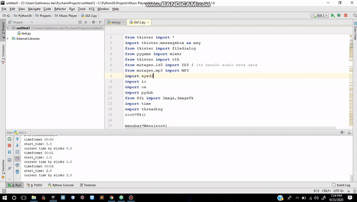

# Music-Player
A music player for windows written in Python 3
<h3>DEMO: </h3>

<h3>Note:</h3>
<ul>
  <li>Please Read and meet the requirements in requirements.txt in order to execute this music plaayer code.</li>
</ul>
